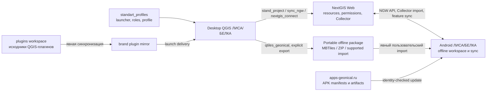

# Экосистема ЛИСА — desktop, плагины и Android

## Владение

| Система | Канонический источник | Ответственность |
|---|---|---|
| Desktop profile | `C:\dev\lisa\standart_profiles` | launcher/bootstrap, QGIS runtime, бренды, роли, эталонный профиль и доставка |
| QGIS Plugins | `C:\dev\lisa\plugins` | исходники плагинов, desktop workflows, подготовка и публикация GIS-ресурсов |
| Android Mobile | этот workspace | полевой клиент, локальное GIS storage, NGW/Collector import и sync, APK release |

`profiles/*/python/plugins/` внутри `standart_profiles` — deployment mirrors, а
не четвёртый источник кода. Изменение плагина выполняется и проверяется в
Plugins workspace, затем отдельно доставляется в desktop profile.

## Поток

Desktop и Android не обмениваются рабочими файлами напрямую. Основная
интеграционная граница — NextGIS Web; offline package является осознанным
переносимым артефактом, а не ссылкой APK на desktop workspace.

## Межпроектные контракты

### NGW/Collector resource

QGIS-инструменты могут создавать, оформлять и синхронизировать ресурсы,
которые затем открывает Android. Совместимыми должны оставаться:

- server URL и стабильная resource identity;
- тип ресурса и дерево ссылок Collector;
- schema полей, права `data.read`/`data.write` и sync direction;
- стили, формы, composition и lifecycle управляемых слоёв;
- различие между server-managed ресурсом и локальной immutable `.ngrc`-подложкой.

В publisher-режиме `vector_only` управляемые `sync_ngw` слои могут содержать
служебное `idqgs BIGINT`. Оно связывает web-объект с первичным `id` PostgreSQL для
одностороннего обновления сервера. Publisher включает `idqgs` в mobile `fields[]`
как `LONG` (`type: 13`), чтобы локальная SQLite-схема совпадала со схемой NGW и
не вызывала повторную перестройку слоя. Колонка в PostgreSQL и изменение
Android-кода не требуются; слой остаётся нередактируемым, контрактное направление —
только NGW → Android.

Выкладка начинается на publisher-side: `stand_project` публикует mobile configs
в `vector_only` с полем `idqgs`. Android независимо сверяет authoritative NGW
resource class/geometry/fields с serialized config и физической SQLite. Если
NGW и SQLite уже содержат `idqgs`, устаревший description чинится как metadata
без скачивания слоя. Ошибочный vector/PostGIS class также чинится как metadata;
refill допустим только при несовпадении geometry или физической таблицы и
публикуется атомарной заменой.

Временный HTTP `5xx` или `ExternalDatabaseError` внешней БД не изменяет этот
контракт и не превращает серверный слой в локальный. Android откладывает только
упавший pull до второго прохода синхронизации, не повторяя уже успешные слои.
Pending локальные изменения отправляются до большого pull; при ошибке push
remote snapshot не применяется. Publisher-side изменений для
такого восстановления не требуется.

Изменение publisher-side логики в `stand_project`, `sync_ngw`,
или `nextgis_connect` требует consumer-smoke в Android, если меняется этот
договор. Внутренний refactoring плагина без изменения ресурса
Android-документацию не затрагивает.

### Offline basemap artifact

`qtiles_geonical` создаёт raster MBTiles/ZIP на desktop и не публикует результат
в NGW автоматически. Передача в Android — отдельное явное действие пользователя
или release-процедуры. Android consumer принимает raster MBTiles с таблицами
`tiles`/`metadata`, Web Mercator tile matrix, поддерживаемым image format и
согласованным zoom/bounds; vector MBTiles этим контрактом не покрывается. Путь к
файлу в desktop workspace частью контракта не является. Нельзя подменять smoke
фактического Android import утверждением, что QGIS успешно создал файл.

### Идентичность и секреты

Desktop credentials, `variables.py`, QGIS auth DB, Android AccountManager и
signing credentials принадлежат разным trust boundaries. В документации
фиксируются имена ключей, server/resource identity и способ проверки, но не
секретные значения. Наличие рабочего desktop login не доказывает, что Android
account type, permission или token настроены правильно.

### Независимый выпуск

`standart_profiles` доставляет desktop profile и плагины; он не доставляет APK.
Мобильный release публикуется независимо и проверяет flavor, application ID,
version, artifact hash и signing certificate. Совместимость с серверными
ресурсами подтверждается отдельным end-to-end smoke, а не совпадением названия
версии desktop и Android.

Различия Android PackageManager не изменяют эту границу доверия: на Android
9–10 updater может получить сертификат archive APK из legacy `signatures`, если
современный `SigningInfo` пуст, но всё равно сравнивает тот же SHA-256 с manifest
и установленным пакетом. Desktop credentials и publisher к этой проверке не
привлекаются.

## Маршрутизация задачи

| Изменение | Проект-владелец | Дополнительный контекст |
|---|---|---|
| launcher, QGIS runtime, role, brand profile | `standart_profiles` | его `AGENTS.md` и `docs/START-HERE.md` |
| исходник QGIS-плагина или WebGIS publisher | `C:\dev\lisa\plugins` | root `AGENTS.md`, `geonical-docs/START-HERE.md`, pack плагина |
| Android import, Collector, sync, storage, updater | этот workspace | root/module `AGENTS.md`, Android registries |
| общий NGW resource contract | publisher и consumer | docs/registry обоих владельцев + end-to-end smoke |
| offline basemap для Android | QGIS plugin + Android importer | qtiles pack, app rendering/storage docs и import smoke |

На текущей машине соседние входы находятся в
`C:\dev\lisa\standart_profiles\docs\START-HERE.md` и
`C:\dev\lisa\plugins\geonical-docs\START-HERE.md`.
Канонические web-входы:
[standart_profiles](https://github.com/GeonicalSys/standart_profiles/blob/main/docs/START-HERE.md)
и
[geonical-docs](https://github.com/GeonicalSys/geonical-docs/blob/main/START-HERE.md).

Точные IDs и проверяемые пути: [ecosystem.yaml](../registry/ecosystem.yaml).

## Правило изменения

1. Определить publisher, consumer и фактически изменяемый контракт.
2. Читать инструкции и registry каждого затронутого владельца.
3. Менять код только в его каноническом source workspace.
4. Обновить app-side `ecosystem.yaml` и основной документ владельца, если
   изменилась внешняя семантика.
5. Выполнить локальные проверки обоих проектов и end-to-end NGW/Collector smoke
   либо явно зафиксировать, что он не выполнен.

Не делать вывод о совместимости по plugin mirror, совпадающему имени слоя,
успешному desktop login или одной только Android-сборке.
