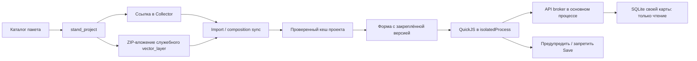

# Пакеты правил мобильного проекта

Правила конкретного Collector-проекта доставляются исходным JavaScript в ZIP.
Доступ к ГИС, датам и будущим расчётам реализуется в APK через фиксированный API.
Внешний код описывает условия и сообщения. Он не получает Android Context,
Java-объекты, SQL, файловую систему, сеть, учётные данные или доступ к записи.
Это первая реализация API v1; перечень ниже отделяет работающие возможности от
следующих этапов. Инструкция оператора: [пользовательское руководство](../guides/project-scripts-user-guide.md).

## Владельцы и доставка

| Часть | Владелец | Ответственность |
|---|---|---|
| Каталог пакета, проверка и публикация | desktop `stand_project` | Детерминированный ZIP, привязки слоёв, обратное скачивание, Collector config, collect/clone |
| Формат, кеш, QuickJS, GIS broker | `maplib` | Проверка пакета, отдельный UID, ограничения ресурсов, чтение своей карты |
| Форма | `maplibui` | События, снимок значений, pin версии, сообщения, Save gate |
| Application lifecycle и native build | `app` | Обычный запуск приложения и минимальный запуск sandbox в обоих брендах |



Нет чтения desktop-профиля с телефона и нет кода в `resource.description`, NGFP,
стиле или мобильном конфиге слоя. Сами вопросы формы остаются в штатном NGFP.
У проекта один пакет; несколько модулей объединяются его manifest/hooks.

`stand_project` создаёт отдельный native `vector_layer` с одной служебной точкой
и ZIP-вложением. Слои PostGIS для хранения пакета не используются. Ссылка
меняется только после скачивания вложения обратно и проверки SHA-256. Старые
ресурсы и версии автоматически не удаляются: ими могут пользоваться черновики.
Удаление требует отдельной согласованной процедуры хранения версий.

## Форматы API v1

ZIP содержит `manifest.json` и исходники `scripts/<name>.js`. Допускаются файлы
`tables/<name>.json`, но API чтения таблиц пока отсутствует. Только UTF-8,
исходники; bytecode, модули `std`/`os`, package managers и загрузка зависимостей
не поддерживаются. Пример минимального manifest:

```json
{
  "schema_version": 1,
  "api_version": 1,
  "id": "audit-check",
  "version": "1.0.0",
  "capabilities": ["gis.query", "time.monthWindow"],
  "layers": {"audits": {"read_fields": ["contractor", "issue", "date_audit"]}},
  "hooks": [{
    "id": "prior-audits", "layer": "audits", "entry": "scripts/check.js",
    "events": ["on_open", "on_field_change", "before_save"],
    "fields": ["contractor"]
  }]
}
```

Слой в исходнике обозначается переносимым alias. Конкретные NGW ID находятся
только в ссылке `collector_project.mobile_json_config.lisa_project_scripts`:

```json
{
  "schema_version": 1,
  "version": "1.0.0",
  "sha256": "<64 строчных hex-символа SHA-256 ZIP>",
  "resource_id": 100,
  "feature_id": 1,
  "attachment_id": 2,
  "failure_policy": "open",
  "layer_bindings": {"audits": 101}
}
```

Публикация сохраняет остальные namespaces `mobile_json_config`. Повторная
публикация идентичного ZIP переиспользует вложение. Изменённый ZIP с прежней
версией отклоняется. SHA-256 проверяет целостность; это не цифровая подпись.
Изменять правила могут пользователи с правами изменения Collector и создания
служебных ресурсов. Выдача этих прав является административной операцией.

В portable `collector_project.json` вместо NGW ID используется отдельный блок:

```json
{
  "mobile_scripts": {
    "package": "audit-check-1.0.0",
    "failure_policy": "open",
    "layer_bindings": {"audits": "stable_layer_keyname"}
  }
}
```

Пакет ищется целиком: `Индивидуальные настройки/project_scripts/<package>` →
`ngw_standard/<profile>/project_scripts/<package>`. Файлы разных источников не
смешиваются. Collect требует постоянные `keyname` слоёв и сохраняет пакет с
эталоном; publish wizard позволяет выбрать слои по названию и ID, в том числе
без keyname. Полное клонирование переносит ZIP, remap привязок и новый carrier.
Клон между серверами без нужного слоя отклоняется; клон на том же сервере может
сохранить внешние ссылки, если они остаются в составе Collector.

## API, встроенный в приложение

Каждый исходник определяет синхронную `function run(ctx)`. Promise/async не
поддерживаются. `ctx` и его интерфейсы заморожены; каждый hook получает новую VM.

| Интерфейс | Реализованное поведение |
|---|---|
| `ctx.apiVersion` | `1` |
| `ctx.event`, `ctx.changedField` | Имя события и изменённое поле либо null |
| `ctx.feature.id`, `.isNew`, `.layer` | ID строкой/null, признак нового объекта, alias текущего слоя |
| `ctx.feature.get(name)` | Снимок разрешённого поля формы; отсутствующее поле — null |
| `ctx.gis.query(alias, options)` | Ограниченная выборка локальной SQLite своей карты |
| `ctx.time.monthWindow()` | `{from, through, until}` как ISO DATE; один календарный месяц назад, сегодня, завтра |
| `ctx.warn(key, message)` | Предупреждение с возможностью продолжить Save |
| `ctx.block(key, message)` | Запрет Save с сохранением открытой формы/черновика |

`query` принимает `fields`, `where` (AND-массив `{field, op, value}`), `limit`.
Операции: `eq`, `ne`, `gte`, `gt`, `lte`, `lt`. Возвращает
`{features: [{id, fields}], truncated, scope: "local", generation}`.
SQL использует placeholders; имена берутся из белого списка схемы и manifest.
DATE — `YYYY-MM-DD`; BIGINT/ID — строки, чтобы избежать потери точности JS.
DATETIME/TIME сохраняют представление мобильной модели. Геометрия не выдаётся.

```javascript
function run(ctx) {
    const window = ctx.time.monthWindow();
    const result = ctx.gis.query("audits", {
        fields: ["contractor"], limit: 1,
        where: [
            {field: "contractor", op: "eq", value: ctx.feature.get("contractor")},
            {field: "issue", op: "eq", value: "Да"},
            {field: "date_audit", op: "gte", value: window.from},
            {field: "date_audit", op: "lt", value: window.until}
        ]
    });
    if (result.features.length) ctx.warn("prior", "У подрядчика уже были аудиты с замечаниями.");
}
```

Broker заново проверяет account, project UID, remote ID, managed origin, текущую
карту и поля при каждом обращении. Одинаковый ID слоя другого аккаунта или
проекта не даёт доступа. Ошибка/отсутствующий слой не превращается в пустую
выборку: hook считается не выполненным.

## Lifecycle, черновики и отказ

Import и безопасный composition sync скачивают пакет на worker и проверяют
формат, hash, версию и присутствие привязанных ID в составе Collector. ZIP
сохраняется через AtomicFile в `<project>/project_scripts/<sha256>.zip`.
`scripts_expected`, `scripts_active`, `scripts_status` принадлежат metadata
этого проекта. При плохом обновлении остаётся последняя проверенная версия и
явный статус `update_failed`. Удаление ссылки отключает правила для новых форм;
кеш для существующих черновиков сохраняется.

Открытая форма закрепляет полную ссылку, включая привязки и failure policy.
Pin переживает Bundle/recreate и FeatureFormDraftStore; обновление проекта
не меняет правила посреди ввода. Явный пустой pin означает «форма без правил».
Чтение данных при каждой проверке свежее; закреплена версия кода, а не история.

`on_open` выполняется после создания controls. `on_field_change` сейчас
поддерживает Spinner и текстовые controls, включая части DoubleCombobox,
с сохранением существующих listeners. Debounce 350 мс, устаревшие результаты
отбрасываются; остальные типы controls проверяются на `before_save`.
`before_save` работает на существующем Save worker до required validation и
до любой транзакции/записи. Фото, outbox и журнал идемпотентного Save остаются
в штатном конвейере. Повтор после частично успешного Save восстанавливает ID из
журнала: уже созданный объект не считается новым аудитом.

Предупреждение подтверждается для конкретного hook, значений watched fields,
ключа и текста. Save всегда пересчитывает условие, но уже подтверждённое
идентичное предупреждение не повторяет. Block подтверждением не обходится.
При ошибке `open` сообщает о неполной проверке и разрешает продолжить;
`closed` сохранять не позволяет. Неисправная сама ссылка считается closed.
Закрытие формы/смена карты отменяют результат; технические ошибки идут в лог,
в диалоге только понятный человеку текст.

## Изоляция и бюджеты

QuickJS 2026-06-04 (MIT) собран из проверенного официального исходника; источник,
SHA-256 и лицензия находятся в `maplib/src/main/cpp/README.md`. JNI не включает
quickjs-libc, Java reflection или arbitrary host dispatch. Service
`exported=false`, `isolatedProcess=true`, отдельный Android UID; Binder принимает
выполнение только от основного UID приложения. Application обеих библиотек и
app выходит до чтения prefs, карт, accounts, GPS и логгеров в sandbox.

| Ресурс | Лимит |
|---|---:|
| ZIP / распакованное содержимое | 2 MiB / 4 MiB |
| Файл / файлов / степень сжатия | 512 KiB / 32 / 100× |
| VM heap / stack | 16 MiB / 512 KiB |
| JS interrupt / process watchdog | 2 с / 4 с |
| Host calls / query rows / все rows | 32 / 200 / 1000 |
| Фильтры / SQL cancellation / host budget | 16 / 500 мс / 2 с |
| Вход или ответ Binder | 128 KiB |
| Сообщений одного запуска / длина текста | 16 / 1000 символов |

Бесконечный JS прерывается, зависший sandbox уничтожает только свой процесс.
Sentry Gradle app-start instrumentation отключён: он вставлял запрещённый
isolated UID вызов перед guard `onCreate`. Остальные tracing/crash reporting
сохраняются; автоматическое измерение времени старта отключено для APK.
NDK 28.2.13676358, CMake 3.22.1; arm64-v8a, armeabi-v7a, x86, x86_64,
ELF page alignment 16 KiB. ABI сборка не заменяет проверку на физическом телефоне.

## Первый пакет и следующие этапы

`examples/project-scripts/contractor-audit` проверяет **создание** аудита по
десяти типам. Сравнение подрядчика — по сохранённому имени, как в этих слоях.
`issue == "Да"`, `date_audit` от даты минус один календарный месяц (включая
границу, с сокращением дня в коротком месяце) до конца сегодняшнего дня.
Например, 31 марта → с 28/29 февраля. Исправленные замечания тоже учитываются:
условие «были», а не «остаются открытыми». 5S и отдельный общий опрос исключены.
`Нет значения`/пустое не проверяется. `не применимо` не объявляется пустым.
Проверяется только загруженная на телефон история, включая локальные объекты;
отсутствие сообщения не доказывает отсутствие замечаний на сервере.

План следующих API: чтение объекта по ID, пространственные фильтры/пересечения,
нормативные таблицы из APK, версионированные domain calculations, lookup
пакетных JSON-таблиц, ограниченное присвоение полей формы. **Они пока не
реализованы**. Не имитировать их произвольным SQL, сетью или большим внешним
JS. Новый capability добавляется сначала в native broker с тестами, лимитами,
системой координат/единицами и версией таблицы, затем используется в пакетах.
`after_save`, изменение других объектов и удалённые вызовы требуют отдельного
контракта транзакций/синхронизации и отдельного решения.

Порядок интеграции: maplib Merge Commit → maplibui Merge Commit → app с pins
удалённых merge commits → desktop publisher/активация правил → release gate.
Draft PR и debug-эмулятор не означают выпуск APK. Отчёт:
[проверки реализации](../reference/project-scripts-verification.md).
