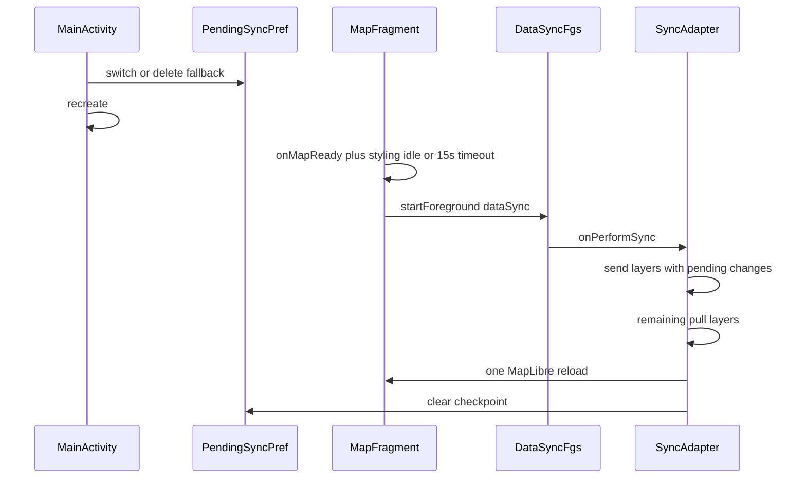

# Handoff: устойчивость NGW data sync / Collector import (Android)

**Статус:** план согласован с пользователем, **код не писали**. Этот файл — передача другому агенту, не действующий контракт. Не коммитить, пока пользователь явно не попросит.

**Задача агента-получателя:** реализовать план ниже (пункты 0/0b/0c, затем 1/2/4/5/6). Не делать пункт 3 (потоковый pull). Не трогать desktop `lisa` PR 49.

Источник Cursor-плана: `C:\Users\lyubi\.cursor\plans\sync_kill_resilience_22478c62.plan.md`  
Чат: [Android sync kill / Collector crash](e3fdfa49-14c8-45e9-892f-095eb3a0054a)  
Дата инцидентов и плана: 2026-08-25.

---

## 1. Сразу прочитать

Рабочий корень Android: `C:\dev\lisa\android_projects\android_gisapp`.

1. Из `C:\dev\lisa`: `powershell -NoProfile -File tools\workspace-preflight.ps1 -Fetch`
2. [`AGENTS.md`](../../AGENTS.md)
3. [`docs/START-HERE.md`](../START-HERE.md)
4. [`docs/guides/change-checklist.md`](../guides/change-checklist.md)
5. [`docs/architecture/ngw-sync-and-storage.md`](../architecture/ngw-sync-and-storage.md)
6. [`docs/architecture/collector-projects.md`](../architecture/collector-projects.md)
7. [`docs/registry/invariants.yaml`](../registry/invariants.yaml) — минимум `INV-PROJECT-OPERATION-EXCLUSION`, `INV-VERSION-COUPLING`, `INV-BACKUP-BEFORE-DESTRUCTION`, `INV-SYNC-ACCOUNT-ISOLATION`, Collector isolation
8. [`docs/registry/change-impact.yaml`](../registry/change-impact.yaml) — триггеры sync / Collector / LayerFill

Язык с пользователем — русский. Имена классов/файлов как в коде.

---

## 2. Git и что нельзя ломать

| Репозиторий | Ветка на момент handoff | Состояние |
|---|---|---|
| `android_gisapp` | `my-maplibre` (tracks `origin/my-maplibre`) | чисто, кроме untracked `.kotlin/` |
| `maplib` submodule | pin `b704187` (`Merge pull request #19 … release-3.1.2.16`), detached HEAD | не мешать |
| `maplibui` submodule | pin `e6335cf4` (`Merge pull request #11 … android9-stability`), detached HEAD | не мешать |
| `easypicker` | pin `f91abdf2` `master` | не в scope |
| desktop `C:\dev\lisa` | `codex/sync-ngw-layer-resolve`, Draft PR https://github.com/GeonicalSys/lisa/pull/49 | **не `git switch`**, не мешать эталон/QGIS |

Правила доставки Android (из `AGENTS.md`):

- Один checkout на ПК. Не `git switch` чужой ветки «для порядка».
- Новая Android-задача: отдельные `codex/<short-task-name>` в каждом затронутом репо (`maplib` → `maplibui` → `android_gisapp`).
- Библиотеки: Merge Commit. Root app: Squash Merge.
- Не push в `my-maplibre`/`main`/`master`, не force-push, не merge без явной просьбы пользователя.
- Dirty tree чужих правок не подмешивать. Сейчас root почти чистый; `.kotlin/` не коммитить.
- Не выносить sync в отдельный процесс `:sync` — сломает `ProjectOperationCoordinator` и одну живую карту (`INV-PROJECT-OPERATION-EXCLUSION`).
- Разрушать/пересоздавать слой только после успешного backup (`INV-BACKUP-BEFORE-DESTRUCTION`). В логе B rebuild пишет «old layer retained until replacement succeeds» — это сохранить.
- Версия: production `3.1.2.16` / `210` в `app/build.gradle` (`productionVersionName` / `productionVersionCode`). План: bump `3.1.2.17` / `211` + coupling `maplib` (`INV-VERSION-COUPLING`), затем `tools\verify-apk-version-matrix.ps1`. Debug остаётся `3.1.2.11` / `205`, если bump только production.

Desktop HCV в Collector-эталоне (слой ЛВПЦ) **уже сделан** в PR 49. Это QGIS/`stand_project`, не Android-код. В этот Android-PR не тащить.

---

## 3. Что просил пользователь (решения)

Хронология только Android-части чата. Desktop `sync_ngw` / ЛВПЦ-эталон ниже кратко, чтобы не перепутать задачи.

1. Пользователь прислал HyperLog после удаления Collector-проекта и «ребута». Просьба сначала: **только объяснить, код не трогать**.
2. Ассистент: это **не crash**, а LMK/OOM-kill во время DATA_SYNC после `PROJECT_SWITCH` + `recreate()` + `scheduleSoon(delay=1)` + уход в фон. `CrashRecovery` смотрит только черновики формы/геометрии/трека.
3. Пользователь: как в будущем избежать обрыва на тяжёлом pull после смены проекта?
4. Ассистент предложил 6 пунктов (см. §5).
5. Пользователь: **спланируй доработку**. Делать **1, 2, 4, 5, 6**. По пункту 4: **один reload после всего sync**; версионируемых слоёв нет — WebGIS не даёт feature versioning для PostGIS. Пункт **3 не делать**, только отдельно объяснить.
6. Пользователь прислал второй лог: импорт Collector «Для инженеров» (azimuth), «загрузился, потом резко ребутнулся на обработке».
7. Ассистент: это уже **настоящий CRASH** (`CalledFromWorkerThreadException: removeLayer` с `LayerFillWorker`). В план добавлены 0 / 0b / 0c **первыми**.
8. Пользователь: собрать план и историю в один файл (этот документ).

Явной команды «реализуй план» ещё не было в том чате. Получатель может реализовывать, если пользователь в новом чате просит сделать эту задачу / выполнить план.

### Выбор по FGS (пункт 2)

Самый надёжный вариант, который пользователь подтвердил через план: **foreground `dataSync` на каждый реальный `onPerformSync`**, не только «когда приложение в фоне». Канал **min importance** (как `layer_fill_fgs_min`): прогресс в приложении, не шумный статус-бар. То же для `OfflineSyncIntentService`.

---

## 4. Два инцидента 2026-08-25

Устройство: Android 16, `035c00047b760aba`, flavor Geonical `com.nextgis.mobile.geonical`, `versionName=3.1.2.16` `versionCode=210`.

### A. LMK, без `[ERROR/CRASH]` (~18:52–18:54, svetopaper)

Сценарий: удалили Collector-проект → автопереключение 788 «Для мастеров» → 787 «Для инженеров».

Ключевые факты:

- `PROJECT_SWITCH` + `MainActivity.recreate()`. WARN `DatabaseHelper.getReadableDatabase()` null — гонка тайлов со снятой БД, **не** причина kill.
- Сразу `SyncAccountWorker.scheduleSoon` **delay=1s**, затем `DATA_SYNC` 16 слоёв аккаунта `svetopaper.nextgis.com`.
- Очередь началась с «Планы_рубок»; у справочников `isRemoteSendAllowed is false`.
- Пользователь: `onPause` / `onStop` ~18:53:24. Sync продолжался в фоне.
- Pull: Планы_рубок, Лесосеки активные, Лесосеки (created 1, analyzing ~3378), старт «Доп. объекты» analyzing 1279 **во время** MapLibre reload GeoJSON «Лесосеки».
- Рестарт: `MainActivity.onCreate` **без** предшествующего `onDestroy`. Нет FATAL / UncaughtException.
- `CrashRecovery hub check completed: no remaining drafts` — только walk/geometry/form drafts.
- После kill `DATA_SYNC remaining=0` без продолжения слоёв: in-memory `ProjectOperationCoordinator`. Локальные `FeatureChanges` в SQLite живы, но send до полевых слоёв не дошёл.

### B. Настоящий crash после Collector import (~19:15, azimuth)

Сценарий: загрузка Collector-проекта «Для инженеров» `remoteId=1403`, 13 vector, 0 raster styles. Workspace `collector_1403_f97c303e`. Переключение с svetopaper 788.

Цепочка:

1. `PROJECT_SWITCH` 788→1403. `MapFragment: MapView MapDrawable != application map; recreating activity to rebind` — **штатно** (`ensureMapViewBoundToApplicationMap`). Не crash.
2. `LAYER_FILL` 13 слоёв. «Выдела» JSON **~40 МБ** (`contentLength=40645380`). Во время fill DATA_SYNC **блокируется** (`Project operation blocked kind=DATA_SYNC` / `onPerformSync skipped`) — правильно.
3. После **каждого** NGW-слоя `LayerFillProgressDialogFragment` при `KEY_SYNC` зовёт `NGWSettingsFragment.setAccountSyncEnabled(..., true)` → `SyncAccountWorker.scheduleSoon` **delay=1**. Отсюда пачка `schedule … delay=1`.
4. `Collector import verify: all 13 layer(s) present with local tables`. `LAYER_FILL remaining=0`. `LayerFillService.onDestroy`.
5. ~1 с спустя DATA_SYNC. Почти все не-полевые слои: `server schema mismatch — scheduling layer rebuild` → 8× `SCHEMA_REBUILD` stacked (`active` до 9). Полевые («Полевые точки/линейные/площадные», «Выдела», «Квартала»): `config description unchanged (hash match)`.
6. Rebuild fill «Планы_рубок» успешен, затем `replaceExistingNgwLayerAfterSuccessfulFill` на **LayerFillWorker** → MapLibre `Style.removeLayer` → uncaught → `LayerFillService.onDestroy`. Очередь rebuild уже поставлена, процесс позже поднимается (`versionName` + `onCreate` без `onDestroy` предыдущей сессии после CRASH).

Стек (сохранить как регрессионный якорь):

```
Uncaught thread=LayerFillWorker
org.maplibre.android.exceptions.CalledFromWorkerThreadException:
  Map interactions should happen on the UI thread. Method invoked from wrong thread is removeLayer.
	at org.maplibre.android.maps.NativeMapView.checkState(NativeMapView.java:127)
	at org.maplibre.android.maps.NativeMapView.removeLayer(NativeMapView.java:986)
	at org.maplibre.android.maps.Style.removeLayer(Style.java:291)
	at com.nextgis.maplib.map.MapDrawable.deleteLayerByID(MapDrawable.java:665)
	at com.nextgis.maplibui.GISApplication.deleteLayerByID(GISApplication.java:2533)
	at com.nextgis.maplib.map.MapEventSource.onLayerDeleted(MapEventSource.java:251)
	at com.nextgis.maplib.map.LayerGroup.removeLayer(LayerGroup.java:606)
	at com.nextgis.maplibui.service.LayerFillService.replaceExistingNgwLayerAfterSuccessfulFill(LayerFillService.java:857)
	at com.nextgis.maplibui.service.LayerFillService.runSingleFillTask(LayerFillService.java:796)
	at com.nextgis.maplibui.service.LayerFillService.drainLoop(LayerFillService.java:583)
phase=loadLayers apply id=562319758 name=Полевые точки
```

Пользовательская формулировка «ребутнулся на обработке загруженного» = этот uncaught на воркере, не LMK и не «ребут ради обработки».

Ложный schema mismatch (idqgs/типы/fingerprint PostGIS vs локальная таблица после свежего fill) **в этом PR не чинить**. Только залогировать fingerprint и не запускать rebuild сразу после успешного fill того же `account+remoteId`.

---

## 5. План реализации (актуальный)

Приоритет: **сначала crash + не стартовать sync/rebuild сразу после import**, потом LMK-пункты 1/2/4/5/6.



### 0. Crash: снятие слоя с UI-потока

[`LayerFillService.replaceExistingNgwLayerAfterSuccessfulFill`](../../maplibui/src/main/java/com/nextgis/maplibui/service/LayerFillService.java) (~837) зовёт `LayerGroup.removeLayer` → [`MapDrawable.deleteLayerByID`](../../maplib/src/main/java/com/nextgis/maplib/map/MapDrawable.java) (~640) → `style.removeLayer` **на `LayerFillWorker`**.

Сделать: SQLite / `existing.delete(true)` можно на воркере; hop `deleteLayerByID` / MapLibre remove на `Handler(Looper.getMainLooper())` и **дождаться** (post+latch), чтобы drain не обогнал UI. **Не глотать** `CalledFromWorkerThreadException`.

`ensureMapViewBoundToApplicationMap` `recreate()` во время `LAYER_FILL` оставить: это не crash. Не планировать DATA_SYNC, пока fill жив.

Юнит-тест «removeLayer не с worker», если есть фейк Style/Map; иначе instrumentation/smoke.

### 0b. Не включать sync на каждый залитый слой

В [`LayerFillProgressDialogFragment`](../../maplibui/src/main/java/com/nextgis/maplibui/fragment/LayerFillProgressDialogFragment.java) (~372–396): при Collector-batch **не** вызывать `setAccountSyncEnabled` / `scheduleSoon` на каждый слой с `KEY_SYNC`.

Один pending DATA_SYNC после `Collector import verify` + map idle (тот же механизм, что пункт 1). Данные уже на диске; мгновенный sync только запускает schema-storm.

### 0c. Не schema-rebuild только что залитый слой

[`GISApplication.scheduleNgwLayerRebuildAfterSchemaMismatch`](../../maplibui/src/main/java/com/nextgis/maplibui/GISApplication.java) (~2103): пропускать, если тот же `account+remoteId` успешно залили в этой сессии (метка в `GISApplication` / journal, TTL ~10 мин). Иначе import → sync → 8 полных re-pull.

`SchemaRebuildRetryGuard` уже есть (2 попытки / 24 ч, 10 мин между). Это недостаточно против «только что залили → сразу mismatch».

Ложный mismatch: залогировать fingerprint в HyperLog. Схему/`idqgs` в этом PR не «чинить».

### 1. Не стартовать тяжёлый pull сразу после switch

Сейчас [`MainActivity.switchCollectorProject`](../../app/src/main/java/com/nextgis/mobile/activity/MainActivity.kt) (~902–918) сразу `SyncAccountWorker.scheduleSoon` (delay **1 с**) и `recreate()`. Gating только `ProjectOperationCoordinator` / layer-fill, **не** готовность карты.

После delete fallback [`ProjectSettingsActivity.deleteProject`](../../app/src/main/java/com/nextgis/mobile/activity/ProjectSettingsActivity.kt) sync **вообще не планирует** — для fallback тоже писать pending.

Сделать:

- Pref `pending_data_sync_account` + workspace key (переживает kill).
- После `activateProject` / delete→web fallback **не** звать `scheduleSoon(1s)`. Писать pending.
- Старт `requestSync`, когда карта простаивает: `MapFragment.onMapReady` **и** render recovery `styling-complete` **или** таймаут **15 с** (если ушли в фон до первого кадра).
- Периодический hourly sync (`delay=3600`) не трогать.
- Лог: `pending data sync armed` / `released after map idle`.

### 2. Foreground `dataSync` на каждый реальный проход

В манифесте у `SyncService` уже `foregroundServiceType="dataSync"`, но `startForeground` нет. Bound SyncAdapter не FGS. [`OfflineSyncIntentService`](../../app/src/main/java/com/nextgis/mobile/util/OfflineSyncIntentService.java) — обычный `startService`.

Сделать сервис по образцу [`LayerFillService`](../../maplibui/src/main/java/com/nextgis/maplibui/service/LayerFillService.java): `startForeground` + `FOREGROUND_SERVICE_TYPE_DATA_SYNC`, канал **min importance**. Обёртка try/finally вокруг реального `onPerformSync` (не skip busy / no-network / no-layers) и тот же путь у offline manual.

Не `:sync` process.

### 4. Один MapLibre reload после всего DATA_SYNC

Per-row reload при pull уже глушит `beginBulkImport`. После слоя с изменениями `NGWVectorLayer.getChangesFromServer` всё ещё зовёт `rebuildCache` + `reloadLayerByID` → `reloadVectorLayerDataToMaplibre` (в логе A: 3378 «Лесосеки» во время следующего pull).

Зеркало fill-defer `isLayerFillBatchDeferringHeavyMapReload`:

- Флаг на `IGISApplication` / `GISApplication`.
- `getChangesFromServer`: `rebuildCache` **оставить** (R-tree). `reloadLayerByID` → enqueue id.
- [`MapViewOverlays.onLayerChanged`](../../maplibui/src/main/java/com/nextgis/maplibui/mapui/MapViewOverlays.java): не грузить style/source, пока defer.
- [`SyncAdapter.completePerformSync`](../../maplib/src/main/java/com/nextgis/maplib/datasource/ngw/SyncAdapter.java): один flush всех id (или один полный style apply).

Инкремент по feature versioning **не входит**.

### 5. Сначала локальные правки

Сейчас DFS по дереву карты; в слое сначала pull, потом send ([`NGWVectorLayer.sync`](../../maplib/src/main/java/com/nextgis/maplib/map/NGWVectorLayer.java) ~1075–1106). В инциденте A очередь с «Планы_рубок».

- **Между слоями** в `syncFirstPass`: сначала `NGWVectorLayer` с `FeatureChanges.getChangeCount > 0`, потом остальные. `ACTION_LPATH` не переставлять.
- **Внутри слоя**: `sendLocalChanges` до `getChangesFromServer`, если `isRemoteSendAllowed`. `isRemoteReadOnly` без send. `NgwPullDecision`: при провале pull **не** двигать tracked timestamp (как сейчас); уже ушедший send не откатывать.

Composition (`CollectorProjectCompositionSync.runApplyForAccount`) оставить **после** data-pass.

### 6. Чекпоинт и дожим после kill

`ProjectOperationCoordinator` in-memory. После kill DATA_SYNC стартует и сразу `remaining=0`.

- Файл/prefs в workspace: `account`, `lastCompletedLayerPath`, `workspaceKey`, `startedAt`.
- Писать **после успешного слоя**. Убитый mid-layer при resume **повторяется** (pull идемпотентен по `FIELD_ID`).
- В начале `syncFirstPass`: чекпоинт того же account+workspace младше 24 ч → пропустить уже завершённые.
- Снять чекпоинт только при полном успехе `completePerformSync`.
- При старте приложения, если чекпоинт есть — тот же pending+map-idle путь, не молчаливый `remaining=0`.
- HyperLog: `sync resume from layer=…`.

`CrashRecovery` **не** расширять на очередь sync.

### Документация и проверки

- Обновить `docs/architecture/ngw-sync-and-storage.md`, packs `app`/`maplib`/`maplibui`, `official-differences.md` если поведение ушло от upstream, changelog, `last_verified`.
- Тесты: partition send-first; checkpoint skip/resume; enqueue+flush reload (без устройства). Gradle: `:maplib:testDebugUnitTest`, `:maplibui:assembleDebug`, `:app:assembleLisaRelease` по затронутым модулям; version matrix после bump.
- Ручной smoke (если нет устройства — явно написать, что не гоняли):
  - импорт Collector «Для инженеров» (azimuth) — без CRASH `removeLayer`, без 8 rebuild сразу после verify;
  - удаление проекта → idle карты → FGS sync;
  - полевые правки раньше крупных pull;
  - карта не перерисовывает каждый слой посреди sync.

---

## 6. Пункт 3 — не делать, зачем он (для пользователя)

Сейчас `getFeatures` качает **весь** JSON слоя в `List<Feature>` (геометрии + атрибуты), затем `analyzing N features` — курсор SQLite **на каждый** объект, плюс `HashSet` всех remote id для удалений. В логе A: 3378 «Лесосеки», сразу 1279 «Доп. объекты», плюс GeoJSON в MapLibre.

Для PostGIS без версионирования каждый sync — полный снимок, не дельта. `DistrictFilter OFF: collector district is empty` качает всё. FGS и отложенный старт снижают kill, но пик кучи на одном слое остаётся.

Чтобы убрать пик, нужен **потоковый** pull: страница NGW (`limit`/`offset` или по id) → пакет в SQLite → освободить список → следующая страница; удаления — отдельный проход id-only или второй запрос без геометрии. Это ломает контракт «сначала весь snapshot, потом reconcile», пересекается с district filter, `beginBulkImport`, backup gate и retry.

Отдельная задача **после** 1/2/4/5/6, если kill на одном слое всё ещё воспроизводится. Пользователь сказал: «про 3-й отдельно расскажи подробнее, подумаю» — реализацию не начинать.

---

## 7. Ключевые файлы

| Файл | Зачем |
|---|---|
| `maplibui/.../service/LayerFillService.java` | 0: UI-thread replace; drainLoop worker |
| `maplib/.../map/MapDrawable.java` | `deleteLayerByID` / `style.removeLayer` |
| `maplibui/.../GISApplication.java` | `deleteLayerByID`, schema rebuild, fill-defer flags |
| `maplibui/.../fragment/LayerFillProgressDialogFragment.java` | 0b: per-layer `setAccountSyncEnabled` |
| `maplibui/.../fragment/NGWSettingsFragment.java` | `setAccountSyncEnabled` → `scheduleSoon` |
| `maplibui/.../mapui/SyncAccountWorker.java` | delay=1 vs hourly |
| `app/.../activity/MainActivity.kt` | `switchCollectorProject` |
| `app/.../activity/ProjectSettingsActivity.kt` | delete fallback |
| `app/.../fragment/MapFragment.kt` | `ensureMapViewBoundToApplicationMap`, `onMapReady`, render recovery, `reloadMapStyleAfterLayerFill` |
| `maplib/.../map/NGWVectorLayer.java` | schema mismatch, `sync()`, `getChangesFromServer`, `getFeatures`, `sendLocalChanges` |
| `maplib/.../util/NGWLayerSchemaCompat.java` | сравнение схемы |
| `maplibui/.../util/SchemaRebuildRetryGuard.java` | уже есть circuit-break |
| `maplibui/.../util/ProjectOperationCoordinator.java` | in-memory leases; DATA_SYNC vs LAYER_FILL |
| `maplibui/.../util/CollectorProjectRegistry.java` | activate/workspace |
| `maplib/.../datasource/ngw/SyncAdapter.java` | `completePerformSync`, слойный проход |
| `app/.../datasource/SyncAdapter.java` | app wrapper |
| `app/.../util/OfflineSyncIntentService.java` | ручной serial sync |
| `maplibui/.../mapui/MapViewOverlays.java` | defer style/source |
| `app/src/main/AndroidManifest.xml` | FGS types |
| `app/build.gradle` + `maplib/build.gradle` | version coupling |

---

## 8. Связанный desktop-контекст (не эта задача)

В том же чате делали QGIS PR 49 (`codex/sync-ngw-layer-resolve`):

- `sync_ngw`: слои по relation, не по имени «ВПЦ».
- Эталон Collector: слой **ЛВПЦ** (`hcv`) после «Планы_рубок», `visible` false, `syncable` false, `min_zoom` 10, `mobile_render_mode` `local_vector_tiles`, красная заливка без контура/подписей. `stand_project` 2.91. Коммит `fca2344`.

Это серверный состав Collector. Android читает его с NGW. После squash merge PR 49 (когда пользователь попросит): `repo_load stand_project` → WebGIS «Обновить мобильные конфиги» → клон/пересоздание «Для инженеров». **Не смешивать с Android-ветками.**

---

## 9. Definition of Done для получателя

1. Preflight + не переключать desktop ветку.
2. `codex/*` в `maplib`, затем `maplibui`, затем `android_gisapp`; связанные Draft PR; в описании порядок merge: библиотеки Merge Commit, потом pin submodule, потом Squash app.
3. Пункты 0, 0b, 0c, 1, 2, 4, 5, 6. Не пункт 3.
4. Docs + changelog + `last_verified`.
5. Unit/assemble по области; version matrix после bump.
6. Smoke с устройства или явный список, что не гоняли.
7. Пользовательские тексты (уведомления FGS) — обычный язык, без URI/stack в UI.

Не merge и не публикация APK без явной просьбы и closure-аудита открытых PR.
